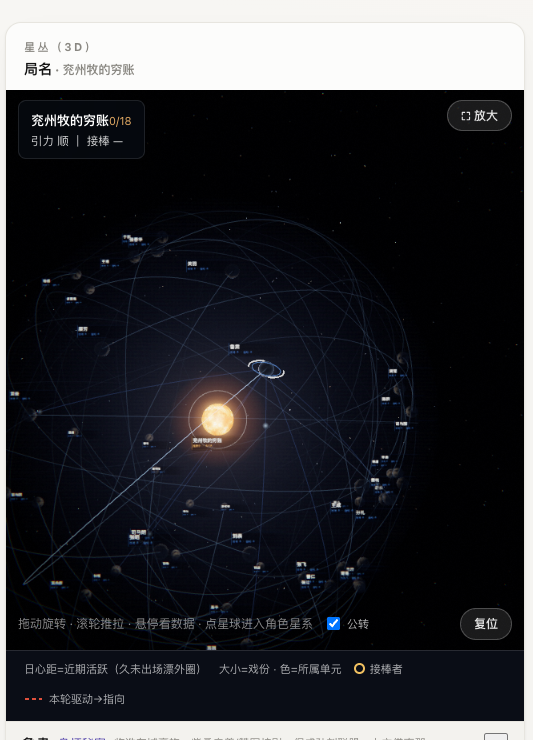
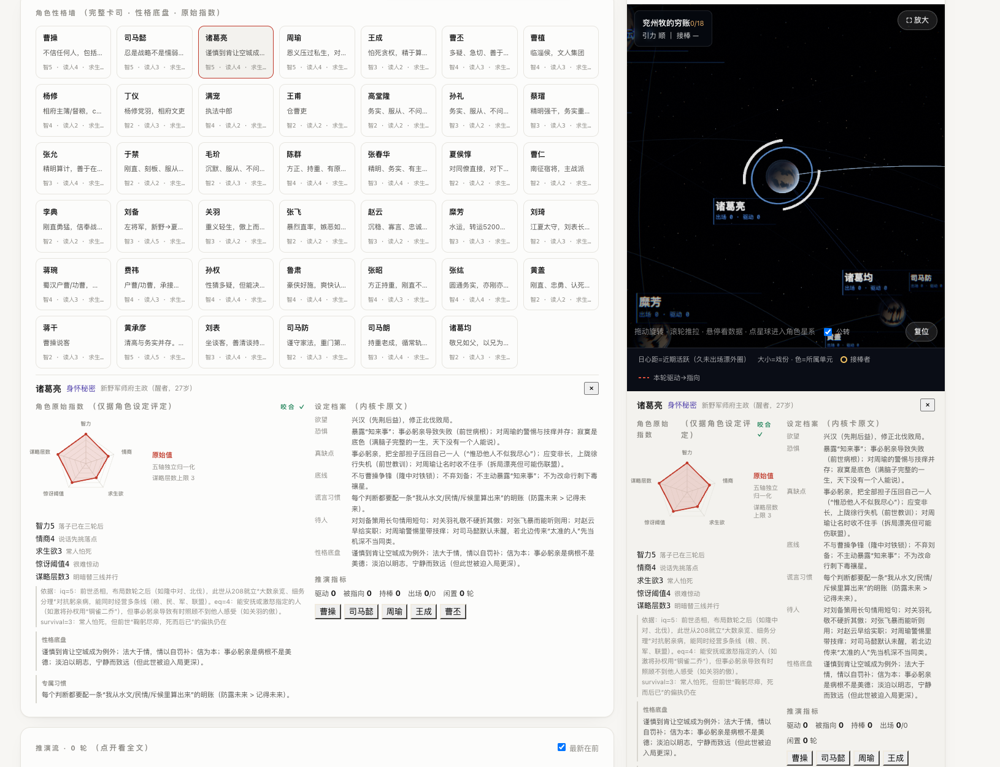

# NEST-DRAMA

[](https://www.gnu.org/licenses/agpl-3.0)
[](https://github.com/63435212cwu-ops/nest-drama/releases/latest)
[](#install--run)

**English** ｜ [中文](README_CN.md)

A unit-story creation engine: build a world for your work, then let independent characters act inside it and drive the plot — producing unit stories, unit plots and volume plots for long- and medium-form fiction, or short stories on their own. Pure Python standard library, zero third-party dependencies; your data and keys never leave your machine.

<p>
  
  
</p>

## Download

- **Release package** (recommended): [Releases](https://github.com/63435212cwu-ops/nest-drama/releases/latest) → `nest-drama-vX.Y.Z-date.zip`, unzip and run; ships with an empty `材料/` (materials) skeleton
- **Source**: `git clone https://github.com/63435212cwu-ops/nest-drama.git`

See [CHANGELOG.md](CHANGELOG.md) for version history.

## Install & run

Requires **Python 3.9+**. No packages to install.

```bash
python3 ui/serve.py
# then open http://localhost:8787
```

1. In the console, enter your LLM connection (any OpenAI-compatible endpoint: URL / model / key)
2. Import your materials — worldview, character bios, outline, existing chapters; plain text is enough
3. Click **Build world**, then start the run

Keep one work per world. If a run is interrupted, resubmit to resume; unchanged materials are not re-billed.

## How it works

1. **Build** — distil the worldview, the plot spine (must-hit / flexible beats) and three cards per character (core / voice / psyche) from your materials
2. **Run** — each round a stage manager picks a driver and a target; every character is an isolated agent that sees only what it should and acts in character. A supervisor judges "would a person do this", a zero-token linter kills mechanical "AI tells", and a numeric ledger keeps every spoken number consistent
3. **Converge** — beats are reached through in-world causality; you can inject, interview, pause, continue and export at any time

## Features

- **Independent characters** — each knows only what it should, and speaks and acts from its own personality, fears and viewpoint
- **World-driven plot** — the spine is a gravity field, not rails; beats arrive through in-world means
- **Anti-AI-tells** — three enforcement layers (zero-token linter, targeted patches, supervisor), length-normalised verdicts, cross-round tic detection and numeric consistency checks
- **Material ingestion** — txt / md / docx / odt / epub / html / rtf / zip / best-effort pdf, with encoding sniffing
- **Galaxy atlas** — a solar-system-style 3D graph that grows with the story: units are star systems, characters are planets, distance from the sun is recency; double-click to dive into a character's own galaxy
- **Cinematic rendering** — ACES / AgX / Neutral tone mapping, bloom, grain, anamorphic flare, colour grades (incl. gilded), procedural nebula, warp transitions, cinema mode, PNG export; one-click "minimal luxe" preset
- **Author control** — gravity modes, god-inject, pause, interview, continue, export; history archive with rollback
- **Day / night themes + global shortcuts** — press `?` for the shortcut sheet
- **Local-first** — materials, drafts and keys stay on your machine; the release packer runs a privacy scan

## Shortcuts

| Key | Action | Key | Action |
|---|---|---|---|
| `1`–`4` | World / Config / Run / Report | `F` | Galaxy fullscreen |
| `C` | Cinema mode | `Space` | Pause / resume orbit |
| `R` | Reset camera | `U` | Switch unit system |
| `Enter` | Dive into selected character | `⌫` | Back to cluster |
| `G` | Quality panel | `S` | Export PNG |
| `/` | Cast search | `T` | Cycle theme |
| `H` | History | `Esc` | Step back out |

## API

Local REST + SSE. `GET /api/schema` lists every endpoint and convention; `GET /api/health` reports version, model status, run state and round; `GET /api/formats` lists accepted material formats and size limits. Every JSON response carries `ok` / `success` (plus `error` on failure) and an `X-NEST-Version` header.

## Data & privacy

- Materials and generated content are stored locally in the project folder; nothing passes through any server
- Your API key lives in `~/.nest-drama/` in your home directory, outside the project and version control
- Engine code and creative data are strictly separated; `pack-release.py` packs only whitelisted engine files and runs a privacy scan

## Layout

```
ui/serve.py                  Engine core: simulation + HTTP server (REST + SSE)
ui/dupian.py                 Language layer: zero-token AI-tell linter + numeric ledger
ui/test_serve.py             Integration tests (mocked LLM, no API cost)
ui/index.html                Frontend page
ui/assets/                   Frontend build artifacts (Vue + three.js)
ui/enhance.js / .css         UI layer: themes, cinematic post-processing, shortcuts, cast search
ui/ui-adjustments.js         History-drawer behaviour patch
ui/THIRD-PARTY-LICENSES.txt  Third-party licenses for the frontend
pack-release.py              Release packaging (whitelist + privacy scan)
docs/                        Screenshots
材料/                        Materials folder (empty skeleton ships with the package)
```

## Tests

```bash
python3 ui/test_serve.py
```

## Contributing & security

- Contributing: [CONTRIBUTING.md](CONTRIBUTING.md) · Code of conduct: [CODE_OF_CONDUCT.md](CODE_OF_CONDUCT.md)
- Security and privacy reports: [SECURITY.md](SECURITY.md)
- Bugs and ideas: [Issues](https://github.com/63435212cwu-ops/nest-drama/issues)

## License

[AGPL-3.0](LICENSE). Free to use, modify and commercialise — but modified versions, and online services built on it, must be made available to their users under the same license. Third-party frontend licenses are listed in `ui/THIRD-PARTY-LICENSES.txt`.
